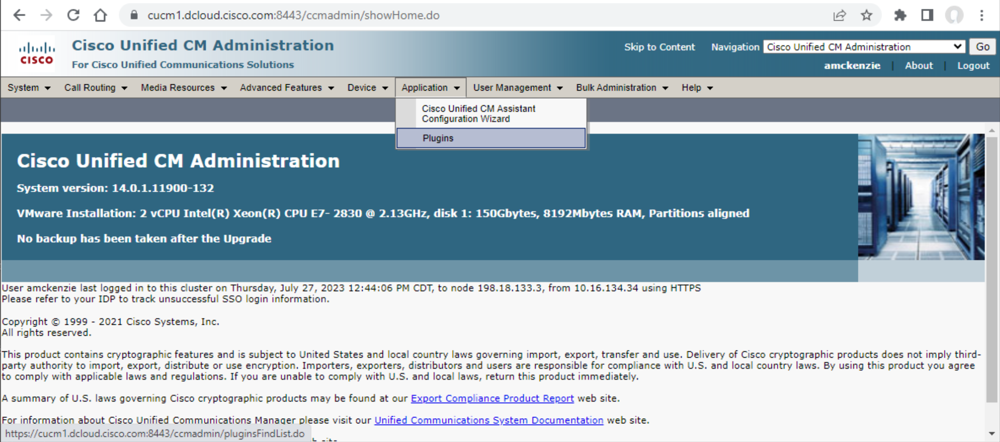
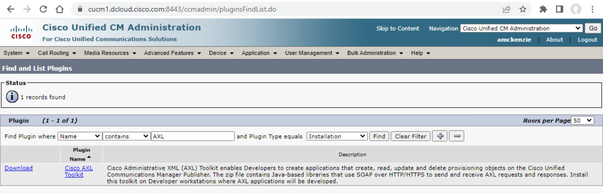

# Cisco CUCM Phone Inventory with Serial

Python script that generates a CSV inventory file named inventory_w_seria.csv with the following fields:

1 Device Description  
2 Phone Extension  
3 Owner User ID  
4 MAC Address  
5 Phone Serial Number  
6 Product Type

### Author:

- Gerardo Chaves (gchaves@cisco.com)
- July 2023

---

### Important Notes

- The serial number and Mac Address will only display for phones that have a routable ip address from the machine from which this python script is running.
- The method this script is using, is grabbing the ip address for the phone, and then web scraping the phone's web page to grab the serial number.
- If phone does not have an IP address, the serial number will show as "unassigned" and if the ip address is unreachable from the hosted server, the serial number will show as "unaccessible"

### Prerequisites

- Python 3.10 or later
- AXL CUCM Toolkit Files
- Enable AXL on CUCM (https://www.uplinx.com/cleanup-tool/webhelp/index.htm?page=Enable-AXL-on-CUCM.htm)
- CUCM Admin Credentials or user that has AXL API permissions
- CUCM and this code has to be hosted under the same subnet for the communication to go through

# Setup instructions

1. Go to CUCM admin page and retrieve the AXL toolkit files from your environment.

1a. Click on Applications and then plugins.


1b. Search for AXL and install the AXL toolkit


2. install and clone this repo onto a server that has python3 installed

3. install and create a virtual environment for your project (https://packaging.python.org/guides/installing-using-pip-and-virtual-environments/)

4. enter the virtual environment by entering the terminal command

```sh
source (venv name)/bin/activate
```

5. install dependencies by entering the terminal command

```sh
pip3 install -r requirements.txt file
```

6. Edit user_env_default.py and add your CUCM environment and user details example:

```
WSDL_PATH = "./schema/AXLAPI.wsdl"
CUCM_LOCATION = "198.18.133.3"
CUCM_USER = "amckenzie"
CUCM_PASSWORD = "dCloud12345!"
```

7. After including your information on the user_env_default.py file, enter the terminal command

```sh
cp user_env_default.py user_env.py
```

8. Enter terminal command to run the script:

```sh
python3 main.py
```

### Running the script periodically

If you wish to run the script periodically you could do so by creating a CRON job in Linux or MacOS or a Windows Task in Windows 10/11/Server.

Below is some guideance on how to do so:

### Linux or MacOS

If new to cron, here are some guides to get you started:  
https://towardsdatascience.com/how-to-schedule-python-scripts-with-cron-the-only-guide-youll-ever-need-deea2df63b4e
https://www.hostinger.com/tutorials/cron-job

Steps:
1.) Set proper permissions (for mac, skip if linux): https://dccxi.com/posts/crontab-not-working-catalina/  
2.) Run `pwd` and `which python3` to get absolute paths to script files and python binary
3.) Run `crontab -e` (this will open VIM editor)
4.) Press `i`, then copy command above (subbing in the absolute paths you found earlier)
5.) Press `esc` key, then enter `:wq` to save

NOTE: if no log file appears after day, or if running on a mac, ensure proper permissions for cron are set.
Follow this guide: https://dccxi.com/posts/crontab-not-working-catalina/

### Windows Tasks

If new to Windows Task Scheduler, here are some guides to get you started:  
https://www.jcchouinard.com/python-automation-using-task-scheduler/

Steps:
1.) Search for 'Task Scheduler'
2.) Go to Actions > Create Task...
3.) Provide a name and description
4.) Run `pwd` and `where python` to get absolute paths to script files and python binary
4.) Create a New Action > provide the path to python binary, add the path to the python script as an argument > Save
5.) Set the trigger (day, frequency, time, etc.)

NOTE: it's recommened to run the task manually through Windows Scheduler first to ensure it works. Check back for errors if no results appear after the scheduled time.

### API Reference/Documentation (VERY USEFUL TO CHECK OUT!):

- [Original code repo from David Staudt using suds python libary (library being used for this project)] (https://github.com/CiscoDevNet/axl-python-suds-sample)
- [AXL reference (uses different python library zeep)] (https://paultursan.com/2016/04/getting-started-with-python-cucm-axl-api-programming/)
- [Risport reference] (https://developer.cisco.com/docs/sxml/#!risport70-api-reference/risport70-api-reference)

## License

Provided under Cisco Sample Code License, for details see [LICENSE](LICENSE)

## Code of Conduct

Our code of conduct is available [here](CODE_OF_CONDUCT.md)

## Contributing

See our contributing guidelines [here](CONTRIBUTING.md)

### DISCLAIMER:

<b>Please note:</b> This script is meant for demo purposes only. All tools/ scripts in this repo are released for use "AS IS" without any warranties of any kind, including, but not limited to their installation, use, or performance. Any use of these scripts and tools is at your own risk. There is no guarantee that they have been through thorough testing in a comparable environment and we are not responsible for any damage or data loss incurred with their use.
You are responsible for reviewing and testing any scripts you run thoroughly before use in any non-testing environment.
